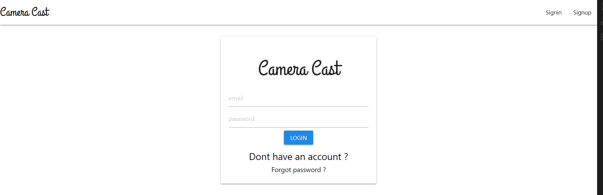

# Camera Cast

## Description
Camera Cast is a simple web application that allows user to share photos with their friends and followers. They also have the ability to like or dislikes photo's that others post and make comments. The user can also upload a profile picture and see the number of followers and following they have.

## Table of Contents
- [Built With](#languages)
- [Installation/Personal Workstation Use](#Install)
- [Usage](#Usage)
- [Contribution](#contributing)
- [Questions](#questions)

## Built With
* HTML
* JavaScript
* CSS 
* Materialize-css
* React JS
* Node JS
* Insomia

## Installation/Personal Workstation Use
To use and test this product on your own machine, you must first clone to repository to your local drive. Next, run NPM Init and and install the following packages.

* bcrypt
* express
* mongoose
* nodemon

After the packages are installed, run NPM start and navigate to http://localhost:3001/

## Usage
View the deployed application [HERE](https://camera-casst.herokuapp.com/signin)

Below is a screenshot of the Camera Cast sign-in page:

## Contribution
This project was made by Group 7 and contains references and material learned in the University of Minnesota Web Dev Bootcamp.

* No Contributions are being accepted at this time.

## Questions
If you have any questions about this application, feel free to reach us through our GitHub profiles or E-mails.

* Zeeshan - [zeeshanmufti1995](https://github.com/zeeshanmufti1995),   [ Zeeshans E-mail](ze30719@gmail.com)
* Sophia - [nguy2935](https://github.com/nguy2935),   [Sophia's E-mail](nguy2935@umn.edu)
* Evan - [epc318](https://github.com/epc318),   [Evan's E-mail](carl4917@umn.edu)
* Adam - [adamcg123](https://github.com/adamcg123),   [Adam's E-mail](adam.gondorchin26@gmail.com)

### ©️2022 Made with you in mind, Group 7 ❤️
